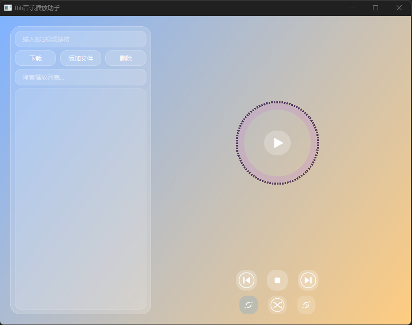
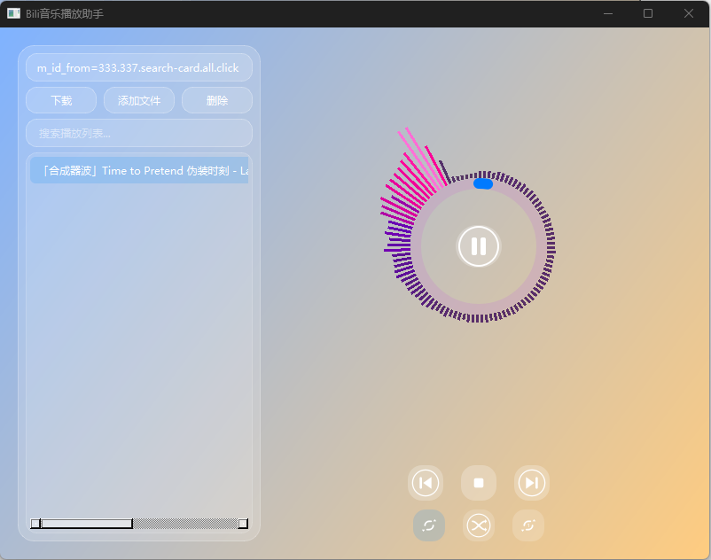

# Bili音乐播放助手

## 项目简介
Bili音乐播放助手是一款基于Python和PyQt6开发的桌面音乐播放器，支持本地音频文件播放和B站视频音频下载播放。界面美观，内置动态频谱显示和圆形进度条，支持多种播放模式（顺序、随机、单曲循环），并带有播放列表管理功能。

## 主要功能
- 支持多种音频格式播放（MP3、WAV、OGG、FLAC、AAC、M4A等）
- 支持从Bilibili视频链接下载音频并自动添加到播放列表
- 动态频谱可视化，实时显示音频频谱
- 圆形进度条显示当前播放进度
- 播放列表管理：添加、删除音频文件，支持搜索过滤
- 多种播放模式切换：顺序播放、随机播放、单曲循环
- 播放控制：播放、暂停、停止、上一首、下一首
- 界面采用渐变背景和现代化按钮样式，用户体验良好





## 环境要求
- Python 3.8 及以上
- PyQt6
- numpy
- pyqtgraph
- 其他依赖库（详见代码中的import部分）

## 安装方法
1. 克隆或下载本项目代码到本地。
2. 安装依赖库：
   ```bash
   pip install -r requirements.txt
   ```
3. 确保网络环境可访问Bilibili，用于音频下载功能。

## 使用说明
1. 运行主程序：
   ```bash
   python player.py
   ```
2. 主界面左侧为播放列表和B站链接输入框：
   - 输入B站视频链接，点击“下载”按钮，程序将自动下载音频并添加到播放列表。
   - 点击“添加文件”按钮，选择本地音频文件添加到播放列表。
   - 选中播放列表中的音频，双击即可播放。
3. 中间区域为动态频谱显示和圆形进度条，播放时实时更新。
4. 底部控制栏包含播放、暂停、停止、上一首、下一首按钮，以及播放模式切换按钮。
5. 支持播放模式切换，满足不同听歌需求。

## 代码结构简述
- `PlayerWindow`：主窗口类，负责界面布局、事件处理和音频播放控制。
- `CollapsiblePlaylist`：播放列表组件，支持文件管理和搜索过滤。
- `SpectrumWidget`：频谱显示组件，基于pyqtgraph绘制动态频谱。
- `CircularProgressBar`：圆形进度条组件，显示播放进度。
- `BilibiliDownloader`：负责B站音频下载（需实现具体下载逻辑）。
- `AudioPlayer`：音频播放封装类，支持播放、暂停、停止等操作。
- 其他辅助组件包括渐变背景、播放按钮图标绘制等。

## 注意事项
- B站下载功能依赖网络和接口稳定，若下载失败请检查网络或更新相关接口代码。
- 播放列表保存为`playlist.json`，程序启动时自动加载。
- 频谱显示和进度条更新频率可在配置中调整。

## 许可证
本项目采用MIT许可证，欢迎自由使用和修改。